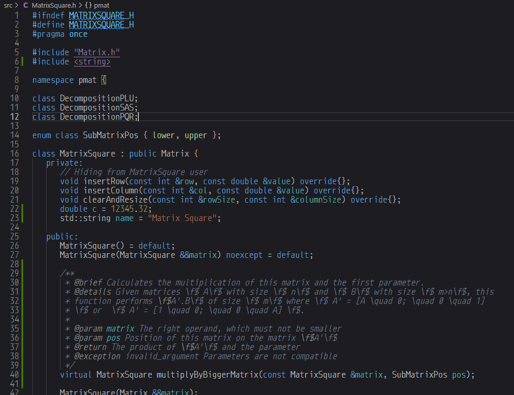

# GreenTea Theme
Soft Color Themes for C/C++ in [VS Code](http://code.visualstudio.com)


## Install

Open Visual Studio Code Market Place in your Visual Studio Code, and search GreenTea Theme. Hit install button, and after finishing install, go to ```Preferences > Color Theme > GreenTea Theme```.

## Screenshots

### Dark GreenTea (based on Visual Studio Dark)



**Enjoy!**
